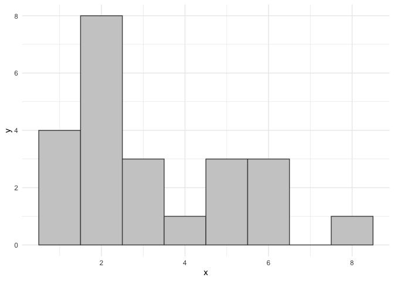
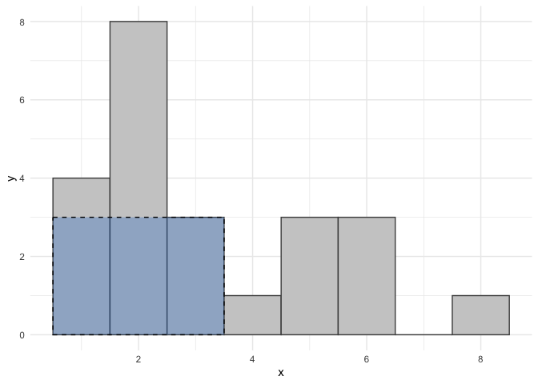
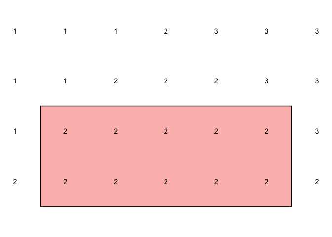
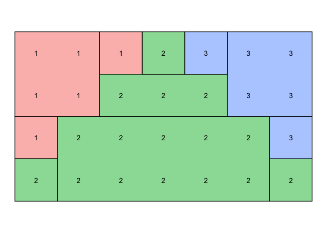
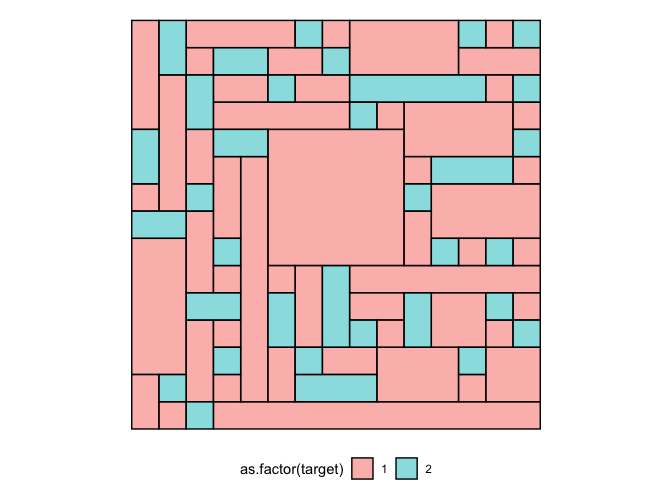
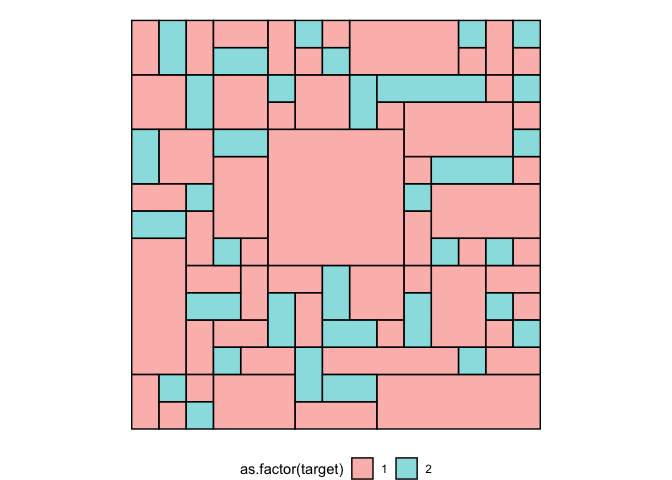

<!-- README.md is generated from README.Rmd. Please edit that file -->

# getrect

<!-- badges: start -->


<!-- badges: end -->

`{getrect}` is a solution to the problem of partitioning a matrix into
rectangular regions - each region only enclosing a single unique value.

## What’s in the box

- `partition_matrix()` partition a matrix into rectangles
- `plot_rects()` Plot the result of `partition_matrix()`
- `max_rect_under_histogram()` calculates the maximum area rectangle
  under a sequence of values representing bar heights of a histogram
- `plot_hist_max_rect()` plot the bar heights and best rectangle

## Future ideas

- There are faster algorithms for ‘max area under a histogram’ than what
  I’ve included here.
- When only rectangles with area = 1 remain, could short-circuit the
  iteration and add them all in bulk.

## Installation

You can install from [GitHub](https://github.com/coolbutuseless/getrect)
with:

``` r
# install.package('remotes')
remotes::install_github('coolbutuseless/getrect')
```

# Problem: Partition matrix into rectangular regions

Partition a matrix into rectangular regions where:

- Each region contains only a single unique value
- An effort is made to minimise the total number of rectangles

# Solution:

- For each unique value:
  - Greedily find the biggest single-valued rectangle at each step

## Key algorithm: Maximum rectangular area under a histogram

Given a sequence of bar heights (representing a histogram), what is the
maximum sized rectangle which can be inscribed?

``` r
library(getrect)

#~~~~~~~~~~~~~~~~~~~~~~~~~~~~~~~~~~~~~~~~~~~~~~~~~~~~~~~~~~~~~~~~~~~~~~~~~~~~
# Define bar heights
#~~~~~~~~~~~~~~~~~~~~~~~~~~~~~~~~~~~~~~~~~~~~~~~~~~~~~~~~~~~~~~~~~~~~~~~~~~~~
hts <- c(4, 8, 3, 1, 3, 3, 0, 1)
plot_hist_max_rect(hts)
```



``` r

#~~~~~~~~~~~~~~~~~~~~~~~~~~~~~~~~~~~~~~~~~~~~~~~~~~~~~~~~~~~~~~~~~~~~~~~~~~~~
# Calculate maximum sized rectangle
#~~~~~~~~~~~~~~~~~~~~~~~~~~~~~~~~~~~~~~~~~~~~~~~~~~~~~~~~~~~~~~~~~~~~~~~~~~~~
rect <- max_rect_under_histogram(hts)
plot_hist_max_rect(hts, rect)
```



# Step-by-step example on example matrix

``` r
mat <- matrix(
  c(1,1,1,2,3,3,3,
    1,1,2,2,2,3,3,
    1,2,2,2,2,2,3,
    2,2,2,2,2,2,2), 
  nrow = 4, ncol = 7, byrow = TRUE
)
mat
#>      [,1] [,2] [,3] [,4] [,5] [,6] [,7]
#> [1,]    1    1    1    2    3    3    3
#> [2,]    1    1    2    2    2    3    3
#> [3,]    1    2    2    2    2    2    3
#> [4,]    2    2    2    2    2    2    2
```

## Consider a single target value

Consider just the value `2` in the matrix.

Create a working matrix `s` with a `1` where the target value exists,
and `0` elsewhere.

``` r
target <- 2
s <- mat
s[] <- mat == 2
s
#>      [,1] [,2] [,3] [,4] [,5] [,6] [,7]
#> [1,]    0    0    0    1    0    0    0
#> [2,]    0    0    1    1    1    0    0
#> [3,]    0    1    1    1    1    1    0
#> [4,]    1    1    1    1    1    1    1
```

## Calculate the vertical runs

Calculate the vertical runs of `1` at every row based upon the rows
above

``` r
s <- apply(s, 2, \(x) ave(x, cumsum(x == 0), FUN = cumsum))
s
#>      [,1] [,2] [,3] [,4] [,5] [,6] [,7]
#> [1,]    0    0    0    1    0    0    0
#> [2,]    0    0    1    2    1    0    0
#> [3,]    0    1    2    3    2    1    0
#> [4,]    1    2    3    4    3    2    1
```

## Consider each row in isolation, and calculate the *max rect under the histogram*

``` r
row_max_rects <- apply(s, 1, \(x) as.data.frame(max_rect_under_histogram(x)))
row_max_rects <- do.call(rbind, row_max_rects)
row_max_rects
#>   area area_alt  ar ar_alt xmin xmax h w
#> 1    1        1 1.0    1.0    4    4 1 1
#> 2    3        3 3.0    3.0    3    5 1 3
#> 3    6        6 1.5    1.5    3    5 2 3
#> 4   10       10 2.5    2.5    2    6 2 5
```

## Pick the best row (max rect area)

``` r
idx <- which.max(row_max_rects$area)
best_rect <- row_max_rects[idx, ]

# Calculate the y extents of the rectangle
best_rect$ymax <- idx
best_rect$ymin <- idx - best_rect$h + 1
best_rect$target <- target
```

## Mark part of matrix as done

``` r
plot_rects(best_rect, mat)
```



## Repeat until no unmarked areas remain



# Larger example

``` r
set.seed(2)
w <- 15
h <- 15
mat <- matrix(sample(c(1, 2), w*h, replace = TRUE, prob = c(4, 1)), h, w)
mat
#>       [,1] [,2] [,3] [,4] [,5] [,6] [,7] [,8] [,9] [,10] [,11] [,12] [,13]
#>  [1,]    1    2    1    1    1    1    2    1    1     1     1     1     2
#>  [2,]    1    2    1    2    2    1    1    2    1     1     1     1     1
#>  [3,]    1    1    2    1    1    2    1    1    2     2     2     2     2
#>  [4,]    1    1    2    1    1    1    1    1    2     1     1     1     1
#>  [5,]    2    1    1    2    2    1    1    1    1     1     1     1     1
#>  [6,]    2    1    1    1    1    1    1    1    1     1     1     2     2
#>  [7,]    1    1    2    1    1    1    1    1    1     1     2     1     1
#>  [8,]    2    2    1    1    1    1    1    1    1     1     1     1     1
#>  [9,]    1    1    1    2    1    1    1    1    1     1     1     2     1
#> [10,]    1    1    1    1    1    1    1    2    1     1     1     1     1
#> [11,]    1    1    2    2    1    2    1    2    1     1     2     1     1
#> [12,]    1    1    1    1    1    2    1    2    2     1     2     1     1
#> [13,]    1    1    1    2    1    1    2    1    1     1     1     1     2
#> [14,]    1    2    1    1    1    1    2    2    2     1     1     1     1
#> [15,]    1    1    2    1    1    1    1    1    1     1     1     1     1
#>       [,14] [,15]
#>  [1,]     1     2
#>  [2,]     1     1
#>  [3,]     1     2
#>  [4,]     1     1
#>  [5,]     1     2
#>  [6,]     2     1
#>  [7,]     1     1
#>  [8,]     1     1
#>  [9,]     2     1
#> [10,]     1     1
#> [11,]     2     1
#> [12,]     1     2
#> [13,]     1     1
#> [14,]     1     1
#> [15,]     1     1

# Partition
rects <- partition_matrix(mat)
plot_rects(rects)
```



# Extension: prefer areas with an aspect ratio close to 1

Same matrix as above, but penalise the selection of rectangles with high
aspect ratio by setting `ar_penalty`.

``` r
rects <- partition_matrix(mat, ar_penalty = 0.9)
plot_rects(rects)
```


